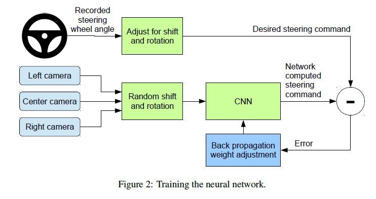
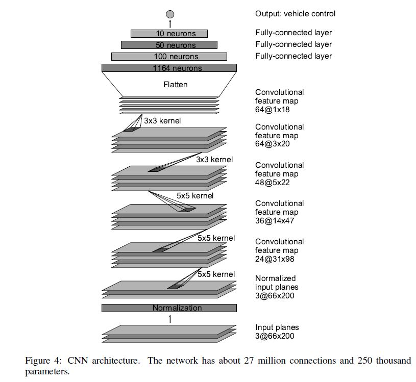
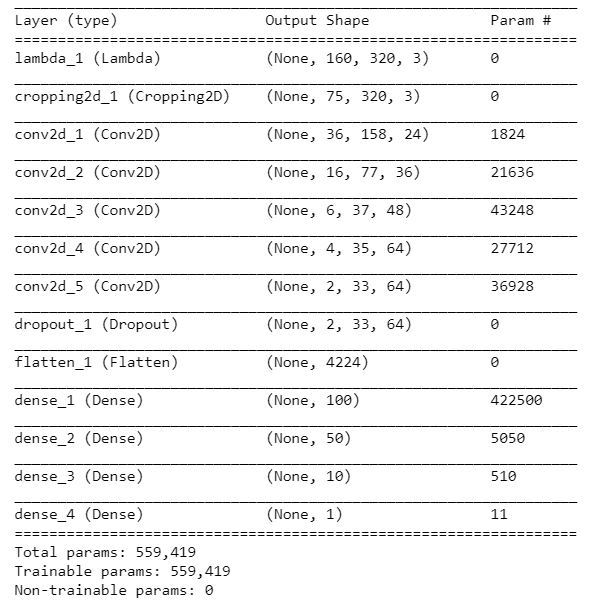
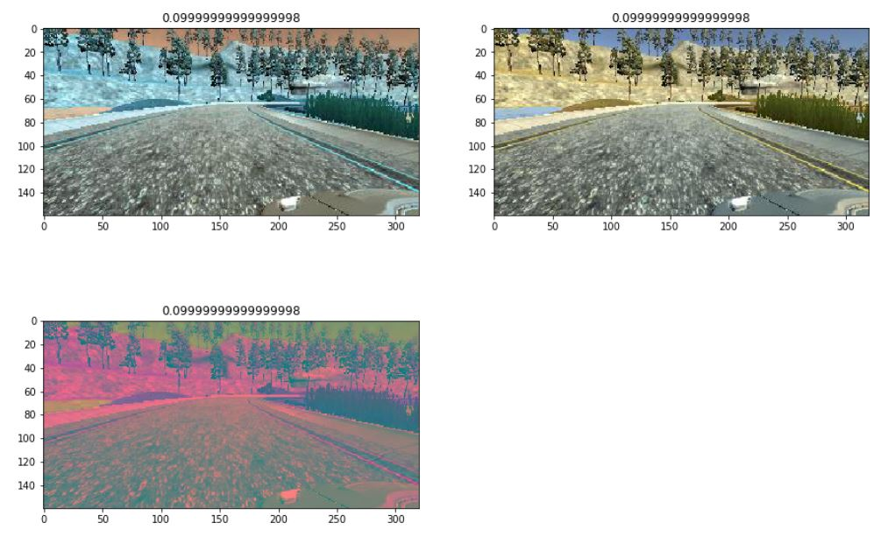
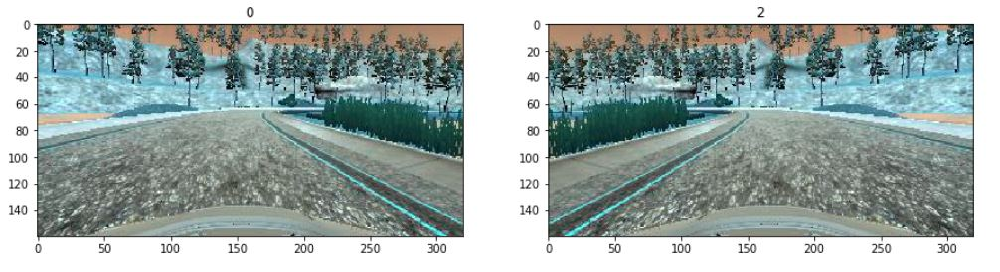

# Behaviorial Cloning Project

Overview:

This architecture flow describes how the controller (python) communicates with vehicle model. The controller adjusts steering angle input according to the images taken from the center camera. However, to me, it looks like the controller just "memorizes" all the images, rather than actually learns how to drive according to surface conditions. I will keep this in mind, and hopefully I can find an answer for myself in the near future. 

The architeture basically refers to the nVIDIA architure, because it has approved to be working successfully. The main difference is that in nVIDIA,the size of input image was 66x200, while in this project, the size was 160x320. 

The first layer is just to normalize the data. 

The second layer is to crop the images where we are interested in, and remove other distracted areas. 

The convolutional layers are a little tricky. Different depths of convolution filters were applied, 24,36,48,64,64. Frankly speaking, I am not quite sure why these numbers were chose for now. But the results turn out to be that they work in my model. I also tried other configurations, such as using less convolutional layers, or less filter depths. The results were not good enough. The vehicle was just turning around with its center, so it intended to drive to its left in the most of time. 

After convolutional layers, then it comes to fully connected layers, and finally the model outputs to a scalar, which is the steering angle to control the vehicle. 

## Data Generation

I failed to train the vehicle well at the first place when I just used the recorded images from 3 cameras. Then I realized the data augmentations were necessary. I applied 2 kinds of augmentations. One is the color and the other one is just flip. 

I think color augmentation just simply generated more images, and it can cover shadow effect, etc. 

For image flipping, it also doubled the number of images, and it could generate both steering left and right cases for the vehilce to learn. 
